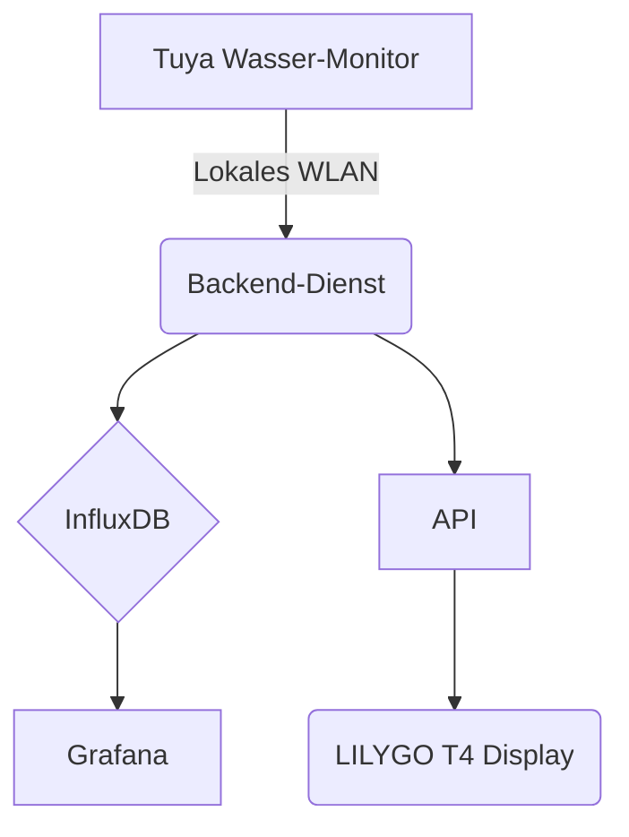

# Willkommen beim Tuya Wasserqualitäts-Monitor

Dieses Projekt bietet eine vollständige, selbst gehostete Lösung zur Überwachung der Wasserqualität mit gängigen Tuya-kompatiblen Geräten. Es ist robust, skalierbar und einfach zu bedienen und gibt Ihnen die volle Kontrolle über Ihre Daten, ohne auf Cloud-Dienste von Drittanbietern angewiesen zu sein.

## Das Problem
Viele IoT-Geräte, insbesondere kostengünstige Sensoren für Endverbraucher, binden Ihre Daten an proprietäre Apps und Cloud-Plattformen. Dies schränkt Ihre Fähigkeit ein, benutzerdefinierte Dashboards zu erstellen, komplexe Automatisierungen auszulösen oder eine langfristige Datenaufbewahrung zu gewährleisten.

## Unsere Lösung
Dieses Projekt befreit Ihre Daten, indem es direkt mit Ihrem Tuya-Gerät in Ihrem lokalen Netzwerk kommuniziert. Es bietet alle notwendigen Komponenten, um Ihre Wasserqualitätsmetriken in Echtzeit zu sammeln, zu speichern, zu visualisieren und darauf zuzugreifen.

### Hauptmerkmale
*   **Lokal zuerst**: Es werden keine Daten an externe Cloud-Dienste gesendet (nach der Ersteinrichtung zum Erhalt des `LocalKey`). Ihre Daten bleiben in Ihrem Netzwerk.
*   **Full-Stack inklusive**: Von der Firmware über die Datenbank bis hin zur API ist alles containerisiert und sofort einsatzbereit.
*   **Erweiterbar**: Ein sauberes FastAPI-Backend und eine Zeitreihendatenbank (InfluxDB) machen die Integration mit anderen Systemen wie Home Assistant oder benutzerdefinierten Anwendungen einfach.
*   **Echtzeit-Anzeige**: Enthält Firmware für ein LILYGO T4 ESP32-Board, das als eigenständiger Echtzeitmonitor fungiert.
*   **Open Source**: Der gesamte Stack ist offen und kann individuell angepasst werden.

Bereit loszulegen? Besuchen Sie die Anleitung [Erste Schritte](./user-guide/getting-started.md).