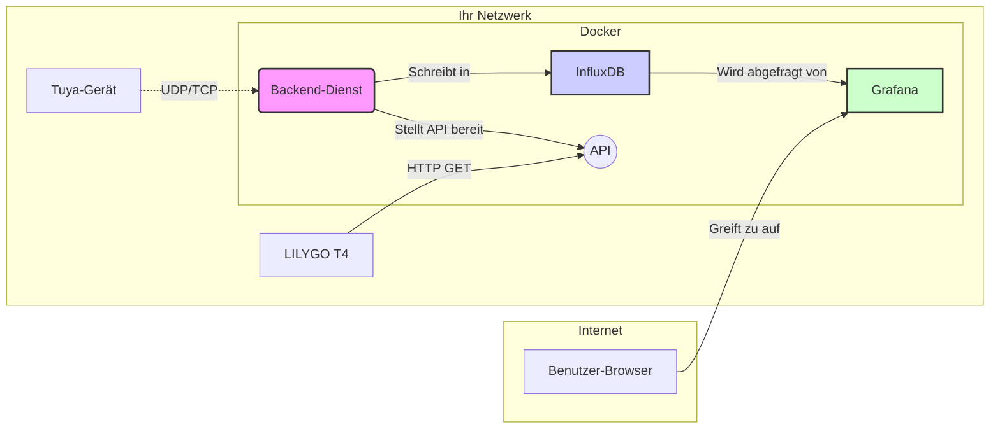

# Architektur

Der Tuya Wasserqualitäts-Monitor basiert auf einer modernen, containerisierten Architektur, die auf Zuverlässigkeit und Trennung der Belange ausgelegt ist.

## Kernkomponenten

### 1. Backend-Dienst

Das Herzstück des Projekts ist eine **FastAPI**-Anwendung, die in Python geschrieben ist. Sie erfüllt zwei Hauptfunktionen:

*   **Datenabfrage (Ingestion)**: Ein Hintergrund-Scheduler (`APScheduler`) ruft periodisch einen Dienst auf, der sich über das lokale Netzwerk mit dem Tuya-Gerät unter Verwendung der `tinytuya`-Bibliothek verbindet. Er sendet Statusanfragen und empfängt verschlüsselte Datennutzlasten.
*   **API-Server**: Er stellt eine RESTful-API für externe Clients bereit. Diese API wird von der LILYGO T4 Hardware-Anzeige verwendet, um die neuesten Daten abzurufen, und kann von jedem anderen Dienst (wie Home Assistant) zur Integration genutzt werden.

### 2. Zeitreihendatenbank (InfluxDB)

Wir verwenden **InfluxDB v2**, eine führende Open-Source-Zeitreihendatenbank. Sie ist speziell für die Verarbeitung von zeitgestempelten Daten konzipiert, was sie für IoT-Metriken extrem effizient macht.

*   **Bucket**: Alle Daten werden in einem dedizierten Bucket gespeichert (Standard: `water_monitor`).
*   **Datenmodell**: Jeder Datenpunkt wird mit der Messung `water_quality`, einem `device_id`-Tag und Feldern für jede Metrik (z.B. `ph`, `temperatur`) gespeichert.
*   **Abfragen**: Die Daten werden mit der **Flux**-Abfragesprache abgefragt.

### 3. Visualisierung (Grafana)

**Grafana** ist der De-facto-Standard zur Erstellung schöner und leistungsfähiger Dashboards für Zeitreihendaten. Es verbindet sich direkt mit InfluxDB als Datenquelle. Sie können Panels erstellen, um zu visualisieren:
*   Echtzeit-Anzeigen für aktuelle Werte.
*   Diagramme, die Trends im Zeitverlauf zeigen.
*   Alarme basierend auf Schwellenwerten.

### 4. Hardware-Anzeige (LILYGO T4)

Das **LILYGO T4** ist ein ESP32-basiertes Entwicklungsboard mit integriertem Bildschirm. Die bereitgestellte Firmware verwandelt es in eine dedizierte, stromsparende Anzeige für Ihre Wasserqualitätsdaten.
*   **Konnektivität**: Es verbindet sich mit Ihrem lokalen WLAN-Netzwerk.
*   **Datenabruf**: In regelmäßigen Abständen macht es eine HTTP-GET-Anfrage an den `/api/v1/data/latest`-Endpunkt des Backends.
*   **Anzeige**: Es verarbeitet die JSON-Antwort und rendert die Werte auf seinem Bildschirm.

## Datenfluss

1.  Der geplante Job des `backend`-Dienstes initiiert eine Verbindung zur IP-Adresse des Tuya-Geräts.
2.  Eine mit dem `LocalKey` verschlüsselte Statusanfrage wird gesendet.
3.  Das Gerät antwortet mit einer verschlüsselten Nutzlast, die alle seine Sensorwerte (Data Points oder DPS) enthält.
4.  Das Backend entschlüsselt die Nutzlast, verarbeitet die DPS-Werte in ein strukturiertes Format (z.B. `{"ph": 7.1, "temperatur": 24.5}`).
5.  Diese strukturierten Daten werden mit einem aktuellen Zeitstempel in das `water_quality`-Bucket in InfluxDB geschrieben.
6.  Die LILYGO T4-Anzeige wacht auf, verbindet sich mit der Backend-API und empfängt den neuesten Datensatz als JSON.
7.  Unabhängig davon betrachtet ein Benutzer ein Grafana-Dashboard in seinem Browser, das InfluxDB nach historischen Daten abfragt, um Diagramme zu rendern.

## Containerisierung (Docker)

Alle serverseitigen Komponenten (`backend`, `influxdb`, `grafana`) sind in einer einzigen `docker-compose.yml`-Datei definiert. Dies bietet:
*   **Isolation**: Jeder Dienst läuft in seinem eigenen Container mit seinen eigenen Abhängigkeiten.
*   **Reproduzierbarkeit**: Garantiert, dass die Anwendung überall auf die gleiche Weise läuft.
*   **Einfache Bereitstellung**: Der gesamte Stack kann mit einem einzigen Befehl gestartet oder gestoppt werden.
