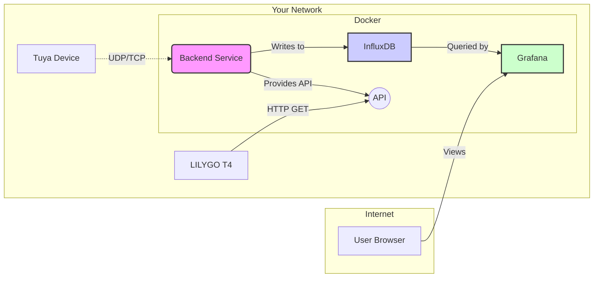

# Architecture

The Tuya Water Quality Monitor is built on a modern, containerized architecture designed for reliability and separation of concerns.

## Core Components

### 1. Backend Service

The heart of the project is a **FastAPI** application written in Python. It serves two primary functions:

*   **Data Polling (Ingestion)**: A background scheduler (`APScheduler`) periodically invokes a service that connects to the Tuya device over the local network using the `tinytuya` library. It sends status requests and receives encrypted data payloads.
*   **API Server**: It exposes a RESTful API for external clients. This API is used by the LILYGO T4 hardware display to fetch the latest data and can be used by any other service (like Home Assistant) for integration.

### 2. Time-Series Database (InfluxDB)

We use **InfluxDB v2**, a leading open-source time-series database. It is purpose-built for handling timestamped data, making it extremely efficient for IoT metrics.

*   **Bucket**: All data is stored in a dedicated bucket (default: `water_monitor`).
*   **Data Model**: Each data point is stored with the `water_quality` measurement, a `device_id` tag, and fields for each metric (e.g., `ph`, `temperature`).
*   **Querying**: The data is queried using the **Flux** query language.

### 3. Visualization (Grafana)

**Grafana** is the de-facto standard for creating beautiful and powerful dashboards for time-series data. It connects directly to InfluxDB as a data source. You can create panels to visualize:
*   Real-time gauges for current values.
*   Graphs showing trends over time.
*   Alerts based on thresholds.

### 4. Hardware Display (LILYGO T4)

The **LILYGO T4** is an ESP32-based development board with a built-in screen. The provided firmware turns it into a dedicated, low-power display for your water quality data.
*   **Connectivity**: It connects to your local WiFi network.
*   **Data Fetching**: Periodically, it makes an HTTP GET request to the backend's `/api/v1/data/latest` endpoint.
*   **Display**: It parses the JSON response and renders the values on its screen.

## Data Flow

1.  The `backend` service's scheduled job initiates a connection to the Tuya device's IP address.
2.  A status request is sent, encrypted with the `LocalKey`.
3.  The device responds with an encrypted payload containing all its sensor values (Data Points or DPS).
4.  The backend decrypts the payload, parses the DPS values into a structured format (e.g., `{"ph": 7.1, "temperature": 24.5}`).
5.  This structured data is written to the `water_quality` bucket in InfluxDB with a current timestamp.
6.  The LILYGO T4 display wakes up, connects to the backend API, and receives the latest data record as JSON.
7.  Separately, a user views a Grafana dashboard in their browser, which queries InfluxDB for historical data to render graphs.

## Containerization (Docker)

All server-side components (`backend`, `influxdb`, `grafana`) are defined in a single `docker-compose.yml` file. This provides:
*   **Isolation**: Each service runs in its own container with its own dependencies.
*   **Reproducibility**: Guarantees that the application runs the same way everywhere.
*   **Ease of Deployment**: The entire stack can be started or stopped with a single command.
